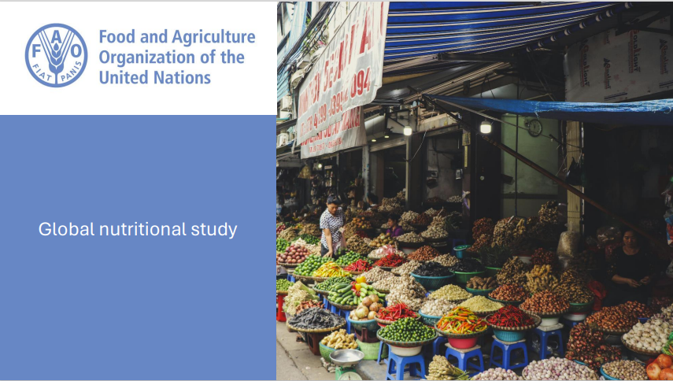

# Public health study on worldwide nutrition

#### Technical Skills: Excel, Python libraries (Pandas, MatplotLib, Seaborn), PowerPoint

For this project, I played the role of a data analyst for the Food and Agriculture Organization of the United Nations (FAO).The organization has the goal of helping to build a world free from hunger.

For this project, I was asked to carry out a large-scale study on the theme of food and, more specifically, undernutrition worldwide.

I was provided with 4 csv files to carry out this analysis:
- Food aid
- Food availability
- Population
- Malnutrition

I first examined malnutrition in terms of the number of people in a state of malnutrition worldwide, how many people could theoretically be fed based on calories available worldwide.

Next I looked at the top cereals used to feed humans and top cereals used as animal feed.

I then zoomed in on countries, looking at the top 10 in terms of:
- Percentage of malnourished people
- Countries that received the most food aid in 2017
- Countries with the most and least calories per capita
- Countries that received the most food aid in 2017

I was also asked to examine cassava availability in Thailand, and the possibility of using it to reduce calorie deficits.

Finally, I did some additional analysis on calories available in countries by the percentage of their population who are malnourished, and the percentage of food wasted by the top 10 countries with the least and most calories available. 

#### View the final report [HERE](https://flossytoo.github.io/portfolio/Project_4/nutrition.pdf)

#### Download the Jupyter notebook and associated files [HERE](https://flossytoo.github.io/portfolio/Project_4/Jupyter.zip)
