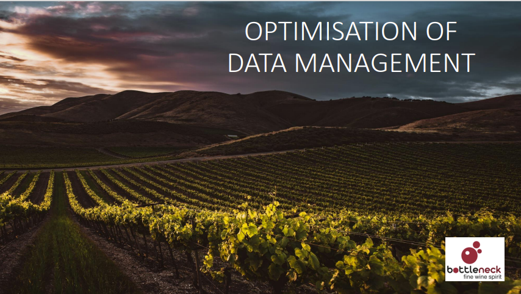

# Optimisation of data management for a wine seller

#### Technical Skills: Excel, Python libraries (Pandas, NumPy, Matplotlib, Seaborn, OpenPyXL), PowerPoint

For this project, I played the role of a data analyst working for a wine seller named BottleNeck. To manage data on their resources, clients etc., they used an enterprise resource planning (ERP) system. However, this system was not linked with their website, where many of their sales are made, making it difficult to conduct data analysis.

While waiting for a more centralized solution, I was tasked with creating a link between the two databases.
- ERP data with product IDs, product prices, and information about whether products are in stock
- CMS data about the products sold online (product name, description, total number of sales and SKUs)

The project had 4 steps:
- Preparing, exploring and cleaning the datasets
- Merging the two datasets thanks to a file linking product IDs with their matching SKUs
- Finding total revenue for each product sold online, as well as total overall online revenue.
- Checking for whether there were any products that had pricing errors

#### View the final report [HERE](https://flossytoo.github.io/portfolio/Project_5/wine_sales.pdf)

#### Download the Jupyter notebook and associated files [HERE](https://flossytoo.github.io/portfolio/Project_5/Jupyter.zip)
