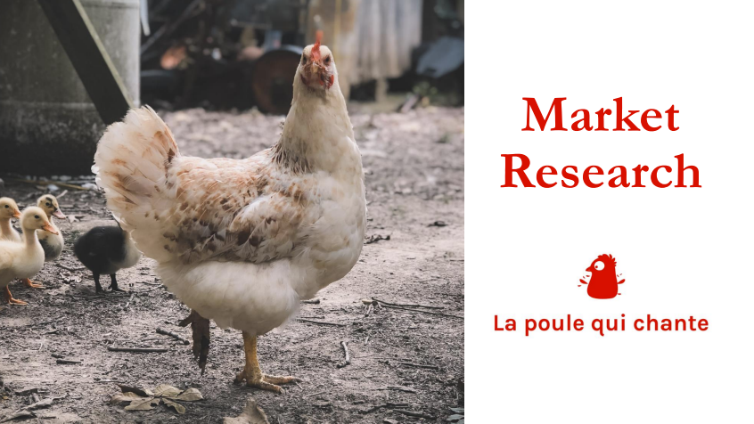
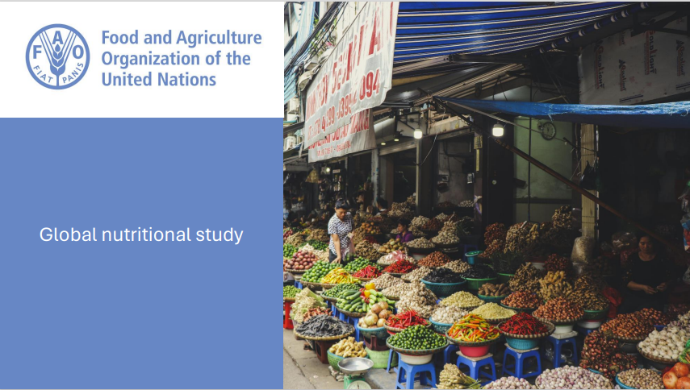

# Kiwi Data Analyst Based in France
#### Technical Skills: Python, SQL, PowerBI, Tableau, Excel

Enthusiastic, curious and analytical professional, with nine years of international experience in
research-focused roles, collaborating with organizations based in the US, New Zealand
and in London. Recently graduated with a Bachelor's in Data Analytics and looking for a position that will allow me to leverage my degree and my previous experience in market researh and analysis.

## Project Portfolio
### Openclassrooms
#### Detection of fake banknotes using machine learning

> Key steps
> - Create a linear regression to impute missing data
> - Create logistic regressions with Statsmodels and Scikit-Learn
> - Use k-means clustering
> - Determine the best machine learning model and successfully predict whether banknotes are real or fake
>  
> #### Read more about the project [HERE](https://flossytoo.github.io/portfolio/Project_10/banknotes)

#### Market research for a food company looking to expand internationally

> Key steps
> - Prepare, clean and perform an exploratory analysis of the data supplied
> - Merge datasets together
> - Perform Hierarchical Ascending Classification
> - Use k-means clustering
> - Perform Principal Component Analysis
> - Identify the best countries for international expansion
>
> #### Read more about the project [HERE](https://flossytoo.github.io/portfolio/Project_9/chicken)

#### Study on world water development

> Key steps
> - Develop a blueprint outlining the key indicators and graphics required
> - Develop a mockup of dashboards at world, regional and national levels
> - Create a Tableau story with dashboards at world, regional and national levels
> - Determine the best countries for creation of water services, improvement of water services and consultancy services
>
> #### Read more about the project [HERE](https://flossytoo.github.io/portfolio/Project_8/water)

#### Analysis of gender equality indicators within a company

> Key steps
> - Prepare data in KNIME, respecting GDPR rules
> - Create graphs showing indicators of equality using KNIME
> - Analyse key findings in order to provide actionable insights
> 
> #### Read more about the project [HERE](https://flossytoo.github.io/portfolio/Project_7/gender_equality)

#### Sales analysis for an online book seller

> Key steps
> - Prepare, clean and perform an exploratory analysis of the data supplied
> - Investigate sales indicators (evolution of revenue over time, revenue by category, product sales, client demographics, client spending, and top 10 clients by purchases and sales)
> - Investigate correlations between client demographics and sales indicators (gender and book category, age and total spending, age and number of purchases, age and basket size, age and category of book purchased)
> - Analyse key findings in order to provide actionable insights
>  
> #### Read more about the project [HERE](https://flossytoo.github.io/portfolio/Project_6/bookstore)

#### Optimisation of data management for a wine seller

> Key steps
> - Prepare, clean and perform an exploratory analysis 
> - Merge files together
> - Identify products generating the most revenue
> - Analyse prices of products to identify outliers
> - Identify the most expensive products
> - Analyse key findings in order to provide actionable insights
>  
> #### Read more about the project [HERE](https://flossytoo.github.io/portfolio/Project_5/wine_sales)

#### Public health study on nutrition worldwide

> Key steps
> - Prepare, clean and perform an exploratory analysis
> - Identify proportion of people who are undernourished, and theorectical number of people who could be fed based on calories available worldwide
> - Analyse use of food for humans vs use of food for animals
> - Identify top 10 countries in terms of various key indicators
> - Analyse use of cassava in Thailand
> - Analyse key findings in order to provide actionable insights
>  
> #### Read more about the project [HERE](https://flossytoo.github.io/portfolio/Project_4/nutrition)

#### Creation of a database for real estate data with SQL

> Key steps
> - Create a data dictionary
> - Creata a database schema
> - Upload data into a database and create tables in it
> - Perform SQL queries to respond to business problems
>
> #### Read more about the project [HERE](https://flossytoo.github.io/portfolio/Project_3/real_estate)

#### Sales analysis for an ecommerce platform

> Key steps
> - Generate graphs in Excel based on the types of data
> - Interpret information provided by a dashboard
> - Summarise results in order to provide actionable insights
>
> #### Read more about the project [HERE](https://flossytoo.github.io/portfolio/Project_2/sales_analysis)

